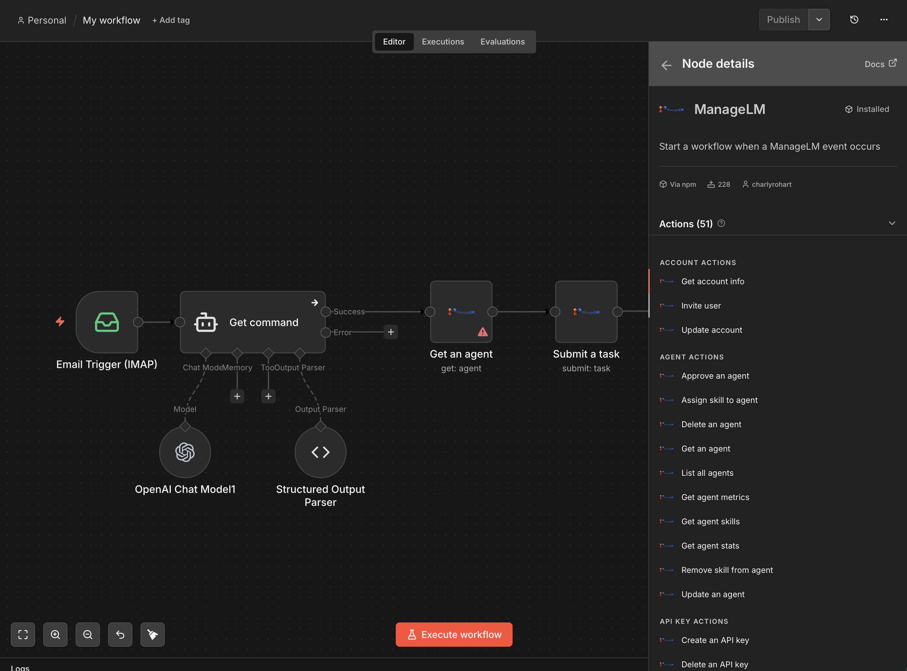

<p align="center">
  <a href="https://www.managelm.com">
    
  </a>
</p>

<h3 align="center">n8n Community Node</h3>

<p align="center">
  Manage Linux &amp; Windows servers, run tasks, and automate infrastructure from n8n workflows.
</p>

<p align="center">
  <a href="LICENSE"></a>
  <a href="https://www.npmjs.com/package/n8n-nodes-managelm"></a>
  <a href="https://www.managelm.com"></a>
  <a href="https://www.managelm.com/plugins/n8n.html"></a>
</p>

<p align="center">
  
</p>

---

The `n8n-nodes-managelm` community node brings full ManageLM infrastructure management into n8n. Automate server tasks, react to events, run security audits, and build ops workflows — all connected to your ManageLM portal.

## Features

- **51 actions** — agents, tasks, search, skills, groups, security, inventory, reports, and more
- **Event triggers** — start workflows on agent enrollment, online/offline, task completion/failure
- **HMAC-verified webhooks** — secure event delivery with automatic webhook lifecycle
- **Wait for completion** — block workflow execution until a server task finishes
- **Cross-infrastructure search** — find agents, packages, services, security findings, SSH keys

## Quick Start

### 1. Install

**Community Nodes (recommended):**

1. Open **Settings > Community Nodes** in your n8n instance
2. Search for `n8n-nodes-managelm`
3. Click **Install**

**Manual:**

```bash
cd ~/.n8n
npm install n8n-nodes-managelm
```

### 2. Configure credentials

1. In your ManageLM portal, go to **Settings > API Keys**
2. Create a new key (`mlm_ak_...`)
3. In n8n, create a **ManageLM API** credential with your portal URL and API key

### 3. Build a workflow

Drag the **ManageLM** node into your canvas and pick an action.

## Nodes

### ManageLM (Action)

| Resource | Operations |
|----------|------------|
| **Agent** | List All, Get, Metrics, Stats, Skills, Assign/Remove Skill, Update, Approve, Delete |
| **Task** | Submit, Get Status, Get Changes, Revert, List |
| **Search** | Agents, Inventory, Security, SSH Keys, Sudo Rules |
| **Skill** | List, Get, Catalog, Import, Create, Update, Delete |
| **Group** | List, Create, Update, Delete, Agents, Members, Skills |
| **Security** | Get Audit, Trigger Audit, Remediate, Export PDF |
| **Inventory** | Get Report, Trigger Scan, Export PDF |
| **Report** | List Operations, Export PDF |
| **Account** | Get Info, Update, Invite User |
| **API Key** | List, Create, Delete |
| **Email** | Send |
| **Audit Log** | List Entries |
| **Notification** | List, Read, Clear |
| **Dependency** | Trigger Scan, Get Results |

### ManageLM Trigger

Start a workflow when a ManageLM event occurs:

| Event | Description |
|-------|-------------|
| `agent.enrolled` | A new agent requests to join |
| `agent.approved` | An agent was approved |
| `agent.online` | An agent came online |
| `agent.offline` | An agent went offline |
| `task.completed` | A task finished successfully |
| `task.failed` | A task failed |
| `task.needs_input` | A task needs user input |

## Example Workflows

**Auto-approve agents and audit:**
1. ManageLM Trigger (`agent.enrolled`) > Approve > Trigger Security Audit

**Alert on server offline:**
1. ManageLM Trigger (`agent.offline`) > Slack / Email / PagerDuty

**Scheduled package updates:**
1. Schedule Trigger (weekly) > Task Submit (`packages`, "Update all packages")

**Inventory to Google Sheets:**
1. Schedule (daily) > List Agents > Get Inventory > Append to Sheets

**Auto-remediate critical findings:**
1. Get Security Audit > IF critical > Remediate

**Find servers with high disk:**
1. Search Agents (`disk_above=80`) > IF results > Notify

## Development

```bash
npm install          # install dependencies
npm run build        # compile TypeScript
npm run dev          # watch mode
npm link             # link into local n8n
```

## Requirements

- **n8n** v1.0+
- **ManageLM account** — [sign up free](https://app.managelm.com/register) (up to 10 agents)
- **API Key** — admin role required

## Other Integrations

- [Claude Code Extension](https://github.com/managelm/claude-extension) — MCP integration for Claude
- [VS Code Extension](https://github.com/managelm/vscode-extension) — `@managelm` in Copilot Chat
- [ChatGPT Plugin](https://github.com/managelm/openai-gpt) — manage servers from ChatGPT
- [Slack Plugin](https://github.com/managelm/slack-plugin) — notifications and commands in Slack
- [OpenClaw Plugin](https://github.com/managelm/openclaw-plugin) — OpenClaw integration

## Links

- [Website](https://www.managelm.com)
- [Full Documentation](https://www.managelm.com/plugins/n8n.html)
- [Portal](https://app.managelm.com)

## License

[Apache 2.0](LICENSE)
