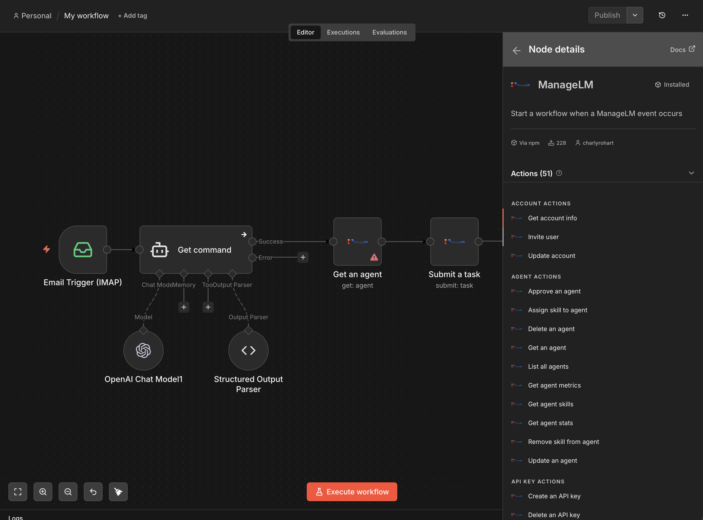

<p align="center">
  <a href="https://www.managelm.com">
    
  </a>
</p>

<h3 align="center">n8n Community Node</h3>

<p align="center">
  Manage Linux &amp; Windows servers, run tasks, and automate infrastructure from n8n workflows.
</p>

<p align="center">
  <a href="LICENSE"></a>
  <a href="https://www.npmjs.com/package/n8n-nodes-managelm"></a>
  <a href="https://www.managelm.com"></a>
  <a href="https://www.managelm.com/plugins/n8n.html"></a>
</p>

<p align="center">
  
</p>

---

The `n8n-nodes-managelm` community node brings ManageLM into n8n. Run tasks and scans on your servers, search the whole fleet, act on hosting resources, and react to events — the same features ManageLM exposes to Claude through MCP.

## Features

- **34 actions** — tasks, scans, 14 fleet searches, hosting actions, agents, skills, account, email
- **Event triggers** — start workflows on any ManageLM event: agents, tasks, reports, monitors, backups, certificates, credentials, keystore, pentests, console / desktop / file sessions
- **HMAC-verified webhooks** — every delivery is checked against your webhook secret, and old deliveries are refused
- **Wait for completion** — wait for a task up to a limit you choose; longer tasks return their ID to poll
- **Cross-infrastructure search** — agents, inventory, security issues, activity, SSH keys, sudo rules, certificates, monitors, backups, credentials, keystore, cloud resources

## Quick Start

### 1. Install

**Community Nodes (recommended):**

1. Open **Settings > Community Nodes** in your n8n instance
2. Search for `n8n-nodes-managelm`
3. Click **Install**

**Manual:**

```bash
cd ~/.n8n
npm install n8n-nodes-managelm
```

### 2. Configure credentials

1. In your ManageLM portal, go to **Settings > MCP & API > API Keys**
2. Create a key (`mlm_ak_...`) and tick the authorizations your workflows need — for example **Reports** to start scans, **Hosting** for VM actions, **Credentials** / **Keystore** to search those
3. In n8n, create a **ManageLM API** credential with your portal URL and API key, then click **Test**

A key acts as you: it sees the servers you can see and can do what you can do, limited to the authorizations you gave it. Any user can create keys. Keys cover the same features as MCP; portal settings and management (users, API keys, webhooks, creating or deleting agents, skills and groups) stay in the portal.

The **ManageLM Trigger** uses a separate **ManageLM Webhook** credential that holds the webhook secret — see [ManageLM Trigger](#managelm-trigger).

### 3. Build a workflow

Drag the **ManageLM** node into your canvas and pick an action.

## Nodes

### ManageLM (Action)

| Resource | Operations |
|----------|------------|
| **Task** | Submit, Get, Get Many, Get Changes, Revert, Answer, Follow Up |
| **Scan** | Start, Get Result — for Security Audit, Inventory, Access (SSH keys & sudo), Certificates, Activity |
| **Search** | Agents, Inventory, Security, Activity, SSH Keys, Sudo Rules, Certificates (Discovered), Certificates (Managed), Monitors, Backups, Credentials, Keystore, Hosting Connectors, Cloud Resources |
| **Hosting** | Get Actions, Run Action |
| **Agent** | Get Many, Get, Get Skills |
| **Skill** | Get Many, Get Catalog |
| **Account** | Get, Get Groups, Get Sites |
| **Email** | Send |

**Waiting for tasks.** Submit, Answer and Follow Up wait up to **Max Wait** seconds (default 120). A task that is still running then comes back as `{ task_id, still_running: true }` — loop on **Task > Get** until its status is `completed`, `failed`, `needs_input` or `timeout` (a task that never reports back is marked `timeout` after 10 minutes).

**Search results.** A search, or a Get Many, returns one item holding the result array — for example `agents` for Search Agents, `items` for Search Inventory, `findings` for Search Security. Add a **Split Out** node on that field to handle the rows one by one.

**Hosting actions.** Run Action executes as soon as the node runs, with no confirmation step — including disruptive actions such as stop, shutdown and reboot.

### ManageLM Trigger

Start a workflow when a ManageLM event occurs. Webhooks are created by an admin in the portal:

1. Add a **ManageLM Trigger** node and copy its **Production URL**
2. In the portal, go to **Settings > MCP & API > Webhooks**, paste the URL, choose the event categories and set an **HMAC secret**
3. In the trigger node, create a **ManageLM Webhook** credential with the same secret
4. Optionally pick the exact events to react to (empty = every event the webhook receives)

Deliveries without a valid signature, or whose signed timestamp is more than 5 minutes off the n8n host's clock, are rejected with `403`. A delivery that repeats one already received in those 5 minutes (a replay, or a portal retry) is acknowledged without starting the workflow again.

**Keep the n8n host's clock synchronized (NTP).** Every rejected delivery counts as a failure on the webhook in the portal, including one refused only because the clocks drifted apart, and the portal disables a webhook after 10 failed deliveries in a row. Once the clock is fixed, re-enable the webhook in **Settings > MCP & API > Webhooks**.

The portal subscribes to categories; tick each one whose events the workflow needs.

| Category | Events |
|----------|--------|
| Agent | `agent.enrolled`, `agent.approved`, `agent.online`, `agent.offline` |
| Task | `task.completed`, `task.failed`, `task.needs_input` |
| Report | `report.completed`, `report.failed`, `report.stalled` |
| Schedules | `schedule.report`, `schedule.failed` |
| Monitor | `monitor.down`, `monitor.up`, `monitor.stalled`, `monitor.created`, `monitor.deleted` |
| Backup | `backup.completed`, `backup.failed` |
| Certificate | `cert.issued`, `cert.renewed`, `cert.renewal_failed`, `cert.revoked`, `cert.reactivated`, `cert.deleted` |
| Credential | `credential.rotated`, `credential.rotation_failed` |
| Keystore | `keystore.access_denied`, `keystore.key_deleted` |
| Pentest | `pentest.completed`, `pentest.failed` |
| Console sessions | `console.opened`, `console.closed` |
| Desktop sessions | `desktop.opened`, `desktop.closed` |
| File sessions | `files.opened` |

## Example Workflows

**Diagnose a down service:**
1. ManageLM Trigger (`monitor.down`) > Task Submit (Agent ID `{{ $json.agent_id }}`, skill `base`, "Find out why {{ $json.monitor_name }} is down") > Slack / Email with the task summary

**Alert on server offline:**
1. ManageLM Trigger (`agent.offline`) > Slack / Email / PagerDuty

**Scheduled package updates:**
1. Schedule Trigger (weekly) > Task Submit (`packages`, "Update all packages")

**Inventory to Google Sheets:**
1. Schedule (daily) > Search Inventory > Split Out (`items`) > Append to Sheets

**Ticket on a failed backup or rotation:**
1. ManageLM Trigger (`backup.failed`, `credential.rotation_failed`) > Jira / ServiceNow

**Find servers with high disk:**
1. Search Agents (`Disk Above % = 80`) > Split Out (`agents`) > Notify for each server

## Upgrading from 1.0.x

This release aligns the node with what ManageLM API keys can reach: the same features as MCP. Workflows saved with 1.0.x keep their parameters, with these exceptions:

- **Removed operations** — they stop with an error naming the operation; pick a current one:
  - Agent: Approve, Update, Delete, Assign / Remove Skill, Get Metrics, Get Stats
  - Skill: Get, Create, Update, Delete, Import
  - Account: Update, Invite User
  - Security: Remediate, Export PDF · Inventory: Export PDF
  - Resources API Key, Audit Log, Dependency, Group, Notification and Report (list groups with **Account > Get Groups**)
- **Security / Inventory moved to Scan** — Get Audit / Get Report become **Scan > Get Result**, Trigger Audit / Trigger Scan become **Scan > Start**, with the matching **Scan Type**
- **Search Inventory categories** — Service, Package and Hardware no longer exist; pick one of the current categories
- **Task wait** — Wait for Completion now waits up to Max Wait and then returns the task ID with `still_running: true` instead of failing
- **Task Get Many status filters** — Pending and Running no longer exist; a running task has the status `sent` (**Sent (Running)**)
- **ManageLM Trigger** — it no longer creates webhooks. Create one in the portal and a ManageLM Webhook credential as described above, then delete the webhooks 1.0.x created (Settings > MCP & API > Webhooks)

## Development

```bash
npm install          # install dependencies
npm run build        # compile TypeScript
npm run dev          # watch mode
npm link             # link into local n8n
```

## Requirements

- **n8n** v1.0+
- **ManageLM account** — [sign up free](https://app.managelm.com/register) (up to 10 agents)
- **API Key** — created by any user in Settings > MCP & API (webhooks for the trigger are set up by an admin)

## Other Integrations

- [Claude Code Extension](https://github.com/managelm/claude-extension) — MCP integration for Claude
- [VS Code Extension](https://github.com/managelm/vscode-extension) — `@managelm` in Copilot Chat
- [ChatGPT Plugin](https://github.com/managelm/openai-gpt) — manage servers from ChatGPT
- [Slack Plugin](https://github.com/managelm/slack-plugin) — notifications and commands in Slack
- [OpenClaw Plugin](https://github.com/managelm/openclaw-plugin) — OpenClaw integration

## Links

- [Website](https://www.managelm.com)
- [Full Documentation](https://www.managelm.com/plugins/n8n.html)
- [Portal](https://app.managelm.com)

## License

[Apache 2.0](LICENSE)
